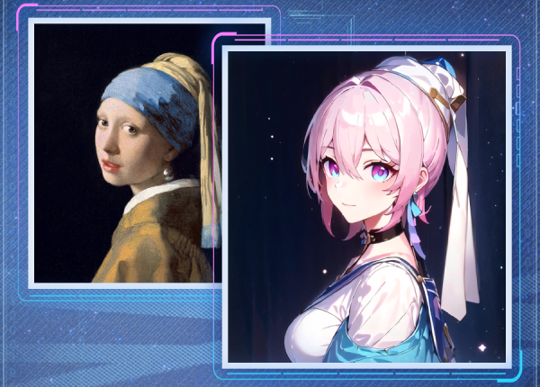

# 无尽的xxx

> 面向开放域主体的角色视觉迁移与主题生成框架
> 角色 LoRA 训练 · 图像角色化 · 页面角色化

一个角色视觉迁移与主题生成框架：使用角色参考图训练 LoRA，将角色的视觉特征迁移到人物、动物或物品，并从角色资料自动构建网页主题。

项目由三条相互关联、但职责不同的流程组成：

- **角色训练**：学习角色的发色、服装、配色及标志配饰。
- **图像角色化**：理解输入主体，在保留可见构图的前提下进行角色特征重绘；物品不应被强行变成人。
- **页面角色化**：提取角色前景、配色和配饰，映射为统一的界面设计变量，而非为每个角色单独编写页面。

> 当前为持续迭代的研究/工程原型。人物五官、手部、服装和配饰还原仍需视觉验收；本文不将目标参考图、历史结果或训练 loss 当作质量达标证明。默认入口是根目录的 `web_ui.py`，不是旧版本的 `web/server.py`。

## 目录

- [目标与示例](#目标与示例)
- [生成效果展示](#生成效果展示)
- [项目结构](#项目结构)
- [环境与模型准备](#环境与模型准备)
- [快速开始](#快速开始)
- [关键方法与技术](#关键方法与技术)
- [角色主题与网页流程](#角色主题与网页流程)
- [参数与输出](#参数与输出)
- [验证、限制与排障](#验证限制与排障)
- [仓库整理与发布](#仓库整理与发布)

## 目标与示例

### 人物角色化的目标

人物场景希望以角色身份、脸部和服装特征为主，原图画风仅作为适度点缀，而不是只给原人物换一个颜色滤镜。

<p align="center">
  
  <br>
  <sub>目标参考图，来自 example/37_1.png；不是当前代码重新生成的验收结果。</sub>
</p>

### 配饰是有结构的角色特征

角色37的相机与四瓣徽章是不同的配饰，不能统一理解为普通花朵。项目通过配饰特写标注、经过校对的角色卡片和语义约束，分别描述其形状、颜色与使用位置。

<p align="center">
  
  &nbsp;
  
  <br>
  <sub>训练/识别参考：012 为相机，013 为徽章。展示素材须随仓库保留，并确认具备公开展示权限。</sub>
</p>

### 网页主题的设计方向

同一个页面骨架，默认使用蓝色科技主题；选择角色后，背景、玻璃面板、边框、点缀和配饰联动变化。下面两张图是设计参考，不是当前网页截图。

<table>
  <tr>
    <th>默认主题目标 · 图7</th>
    <th>角色37主题目标 · 图8</th>
  </tr>
  <tr>
    <td></td>
    <td></td>
  </tr>
</table>

当前页面使用 HTML、CSS、SVG 和 Canvas 实现上述构图方向，不把参考图整张铺成不可交互的页面。封面名称为“无尽的xxx”，不显示 pm，使用缓慢光带与粒子连线作为背景动态效果。

## 生成效果展示

以下为项目当前已有文件的输入/输出对比，左侧来自 `input/`，右侧来自 `output/result/`。

<table>
  <tr><th>样例</th><th>输入</th><th>已有生成结果</th></tr>
  <tr><td>cat</td><td></td><td></td></tr>
  <tr><td>cup</td><td></td><td></td></tr>
  <tr><td>human</td><td></td><td></td></tr>
  <tr><td>human2</td><td></td><td></td></tr>
  <tr><td>jian1</td><td></td><td></td></tr>
  <tr><td>jian2</td><td></td><td></td></tr>
</table>


## 项目结构

下面是**保留现有入口所需的代码，以及本 README 引用的文档/素材**。未列入旧备份、开发会话、旧网页上传、历史消融输出等归档内容。标注“本地”的目录需要准备或由运行生成，不意味着应把全部内容提交到 GitHub。

```text
Endless_xxx/
├── README.md
├── config.py                      # 模型路径、角色配置、训练/推理参数
├── train.py                       # 标准 UNet LoRA 训练入口
├── weight_selection.py            # CLI/网页共用的确定性 LoRA 选择
├── training_run.py                # 共享隔离运行：数据副本、快照、哈希和状态记录
├── G24/
│   ├── train_24.py                # 24GB 入口，复用根目录 train.py
│   ├── config_24.py               # 24GB 超参数独立配置
│   └── README_G24.md              # 使用说明
├── test.py                        # 图像角色化推理入口，不是单元测试入口
├── web_ui.py                      # 本地网页入口，127.0.0.1:7860
├── build_theme.py                 # 单独构建指定角色的网页主题
├── dataset.py                     # 角色数据读取、标签与混合裁剪/比例桶
├── model_utils.py                 # SDXL/VAE/ControlNet 加载和 LoRA 注入、保存
├── train_utils.py                 # 扩散训练步、文本编码、固定参考诊断与曲线
├── image_utils.py                 # 图像读取、等比缩放、Canny 等工具
├── character/
│   ├── __init__.py
│   ├── character_parser.py        # 代表图选择与角色参考解析
│   ├── semantic_memory.py         # 角色记忆、角色卡合并与配饰迁移规划
│   ├── transfer_constraints.py    # 可见区域、构图与双 tokenizer 提示词预算
│   ├── inference_policy.py        # 人物/动物/物品的差异化生成参数
│   └── object_policy.py           # 物品材质、表面和配饰放置约束
├── vision/
│   ├── __init__.py
│   ├── subject_analyzer.py        # 输入主体类型、可见部分与画风分析
│   ├── segmentation.py           # SAM2 加载与主体分割
│   ├── background_guard.py        # 可选背景保护与掩码检查
│   └── accessory_refiner.py       # 实验性局部配饰重绘工具，非默认推理必经阶段
├── vlm/
│   ├── __init__.py
│   └── vlm_utils.py               # Qwen2.5-VL 封装、JSON 解析与提示词
├── webapp/
│   ├── __init__.py
│   ├── server.py                  # Flask API、文件校验、任务队列
│   ├── worker.py                  # 训练/推理/主题任务的独立子进程
│   ├── theme.py                   # 前景、配饰、颜色统计与主题缓存
│   ├── segmentation.py            # 主题专用的带引导 SAM2 分割
│   └── static/
│       ├── index.html             # 封面、生成和训练视图模板
│       ├── style.css             # 布局、玻璃质感、响应式样式
│       ├── app.js                # 上传、角色选择、任务状态和交互
│       ├── theme.js              # 统一 CSS 变量与确定性配饰布局
│       └── cover.js              # 封面粒子连线动画
├── dataset/
│   ├── data_preprocessing.py      # 代码文件，不能随数据集整体忽略
│   └── 37/                       # 本地角色资料；公开提交前确认素材权限
│       ├── captions.txt
│       └── images/001.png ... 020.png
├── histories/
│   └── scripts/
│       └── audit_web_assets.py    # 可选：主题抠图检查图生成工具
├── f_example/
│   ├── pm.png                    # 网页运行素材，必须保留
│   ├── bb.png                    # 网页运行素材，必须保留
│   ├── 7.png                     # 本 README 的设计参考图
│   └── 8.png                     # 本 README 的设计参考图
├── example/
│   └── 37_1.png                  # 本 README 的人物角色化目标图
├── tests/
│   ├── test_training_entries.py   # 隔离运行、失败恢复与24GB参数/显存门槛
│   ├── test_transfer_constraints.py
│   └── test_web_workspace.py
├── docs/
│   ├── GitHub上传整理清单.md
│   └── 前端角色主题实现_20260910.md
├── models/                       # 本地外部模型，详见下文，不建议普通 Git 提交
├── input/                        # 本地推理输入，由使用者自行提供
└── output/                       # 本地权重/结果/缓存，运行生成
    ├── 24/                       # 24GB独立输出：train_models / curves / logs
    ├── train_models/
    ├── curves/
    ├── logs/
    ├── semantic/
    ├── result/
    ├── experiments/              # 旧实验归档，不属于新入口默认输出
    └── web_themes/               # 主题 JSON 和透明素材缓存
```

注意：根目录 `dataset.py` 是 Python 模块，`dataset/` 是数据与预处理脚本目录。当前训练代码动态加载预处理文件，不要随意添加 `dataset/__init__.py` 或整体重命名它们。

当前只保留一套训练核心：根目录 `train.py`。原 `train_reviewed.py` 的隔离保存能力已合入默认命令行流程；旧 G24 双文本编码器改版和根目录旧 `train_24.py` 已移除。新的 [24GB 参数版](G24/README_G24.md) 位于 `G24/`，仅提高超参数，不维护另一套训练循环。

## 环境与模型准备

### 开发环境

已使用的环境是 Windows、Python 3.9.25、NVIDIA RTX 4060 8GB，以及以下主要依赖。8GB 是当前调试目标，不是所有参数组合都能运行的保证；Linux/macOS 和其他 GPU 未在本轮重新验证。

| 组件 | 本地版本 | 用途 |
|---|---|---|
| torch / torchvision | 2.2.1+cu121 / 0.17.1+cu121 | CUDA、训练和图像变换 |
| diffusers | 0.31.0 | SDXL、ControlNet、img2img |
| transformers | 4.56.2 | Qwen VL、SAM2、文本编码器 |
| peft | 0.17.1 | LoRA |
| accelerate | 1.10.1 | 模型加载和 offload |
| safetensors | 0.6.2 | 权重读写 |
| numpy / Pillow | 1.24.4 / 11.1.0 | 图像及数组处理 |
| opencv-python | 4.10.0.84 | 边缘和前景处理 |
| matplotlib | 3.4.3 | 训练曲线 |
| huggingface-hub | 0.34.4 | 模型配置与缓存 |
| Flask | 3.1.2 | 本地网页后端 |
| bitsandbytes | 0.43.3，可选 | 8bit Adam；不可用时回退 AdamW |

可按当前环境版本建立独立环境；以下命令是安装起点，不是已完成全新环境重装验证的锁文件：

```bash
conda create -n endless python=3.9
conda activate endless

python -m pip install torch==2.2.1+cu121 torchvision==0.17.1+cu121 --index-url https://download.pytorch.org/whl/cu121
python -m pip install diffusers==0.31.0 transformers==4.56.2 peft==0.17.1 accelerate==1.10.1 safetensors==0.6.2 huggingface-hub==0.34.4
python -m pip install numpy==1.24.4 Pillow==11.1.0 opencv-python==4.10.0.84 matplotlib==3.4.3 Flask==3.1.2

# 可选；具体是否可用取决于平台和 CUDA 环境
python -m pip install bitsandbytes==0.43.3

python -c "import torch; print(torch.__version__); print(torch.cuda.is_available())"
```

前端无 Node 构建步骤，不需要 npm。模型和训练环境仍然需要单独安装，启动页面不代表 GPU 链路已准备完成。

### 本地模型布局

```text
models/
├── Illustrious-xl-early-release-v0/
│   └── Illustrious-XL-v0.1.safetensors
├── sdxl-vae-fp16-fix/
│   └── sdxl.vae.safetensors
├── controlnet-canny-sdxl-1.0/
│   ├── config.json
│   └── diffusion_pytorch_model.fp16.safetensors
├── Qwen2.5-VL-3B-Instruct/
│   └── 完整模型目录：权重分片、索引、tokenizer、processor 和配置
└── sam2/
    └── 完整模型目录：model.safetensors、processor 和配置
```

- Illustrious XL 是 SDXL 架构的生成底模；VAE 使用 fp16 修复版。
- ControlNet-Canny 约束输入边缘结构，Qwen VL 负责视觉语义，SAM2 负责分割。
- 路径集中在 `config.py`，可修改为已有模型的实际位置。
- IP-Adapter 当前关闭，项目未配备对应权重，不要只打开开关便认为功能可用。
- `from_single_file` 除权重外还可能需要配套的 SDXL 配置和 tokenizer 缓存。只有一个 safetensors 文件不等于能够完全离线启动。
- 网页工作进程默认设置离线模式；先准备完整依赖和缓存。新的命令行训练/推理入口使用 `config.HF_ENDPOINT`，当前配置为镜像地址；如需完全离线，请自行设置离线环境变量并准备对应缓存。
- 本项目不把第三方模型自动作为代码仓库的一部分分发；模型版本、来源和使用条件需单独记录。

## 快速开始

所有命令在项目根目录执行。

### 1. 准备角色数据

```text
dataset/my_character/
├── images/
│   ├── 001.png
│   ├── 002.png
│   └── 003.png
└── captions.txt
```

**标签文件不是必需的。** 缺少 `captions.txt` 时，默认预处理会调用现有 VLM 尝试自动补充，但不保证标注质量或一定成功，优先建议手动添加并校对标签，尤其是配饰特写。该功能要求 VLM 可用且 `AUTO_PREPROCESS_DATASET=True`；关闭预处理后不会自动补齐。已有标签文件不会自动逐条补齐遗漏项。命令行标注失败会告警并可能继续使用空标签，网页在缺少标签且标注失败时会报告失败。

手动标签文件使用 UTF-8，每行先写图片文件名，再写逗号分隔的短标签：

```text
001.png, full body, pink hair, blue jacket, white blouse
002.png, upper body, front view, blue ribbon
003.png, accessory close-up, four-petal emblem, isolated on white background
```

特写图应明确写成配饰特写，不要将相机或徽章标注为完整人物。建议参考图同时覆盖全身、脸部、服装与关键配饰，避免全部是同一角度的脸部图。

在 `config.py` 设置 `CHARACTER_ID`，并按需添加 `CHARACTER_PRESETS`：

```python
CHARACTER_ID = "my_character"
CHARACTER_PRESETS = {
    "my_character": {
        "category": "1girl",
        "resolution": 640,
        "max_train_steps": 600,
    },
}
```

这是配置示例，不是所有角色的最优参数。触发词由目录名生成，例如 `chmy_character`。为非人物角色训练时应明确设置合理的 `category`，不要沿用默认的 `1girl`。

### 2. 训练角色 LoRA

```bash
python train.py
```

流程：CUDA 检查 → 角色选择 → 建立独立运行目录并复制数据 → 在副本上预处理/补标签 → 文本条件缓存 → UNet LoRA 训练 → 定期诊断、checkpoint、曲线和最终权重。

默认 `TRAIN_ISOLATED_RUN=True` 仅保护源数据：将图片/标签复制到 `output/logs/training/run_<时间>/dataset/`，预处理只修改副本，自动补出的标签审核后可回填原数据。权重仍直接保存到 `output/train_models/`，曲线写入 `output/curves/`，不会再被隔离包装改到其他位置。

训练完成检查 `output/train_models/<角色>_final.safetensors`、日志目录的 `manifest.json` 和曲线。网页读取同一模型目录，不需要复制/导入新权重。**同角色重复训练会覆盖同名 final/best/checkpoint；需保留旧版时请先备份。** 不要让多个命令行/网页训练进程同时写同一角色；网页队列仅串行化网页自己的任务。

此入口适用于当前选择的角色，不再固定为37，也不是断点续训。若关闭 `TRAIN_ISOLATED_RUN`，会回到直接使用源数据及标准输出路径的行为；此时自动预处理可能改名、转换格式并删除对应原格式文件，同名权重也可能被覆盖，请自行备份。

#### 24GB 显存参数版

```bash
python G24/train_24.py
```

角色仍由根目录 `config.CHARACTER_ID` 选择；高显存参数统一在 `G24/config_24.py` 修改。默认1024分辨率、rank/alpha 64、1500步、学习率1.2e-4、batch 1、fp16，继续使用 UNet LoRA 和冻结文本编码器缓存。只覆盖当前选择角色的分辨率/步数，不写死角色37。

24GB入口独立写入 `output/24/train_models/`、`output/24/curves/` 和 `output/24/logs/`，不会覆盖标准版；同一24GB角色重复训练仍会覆盖自己的同名权重，请先备份。启动要求 CUDA 且可见显存至少22 GiB（面向标称24GB设备）；本机8GB不会启动该训练。提高参数不保证更好效果，24GB实际训练速度、显存峰值和质量仍需在对应硬件上验证。详细说明见 [G24/README_G24.md](G24/README_G24.md)。

### 3. 运行图像角色化

在 `config.py` 设置：

```python
CHARACTER_ID = "my_character"
# 默认 LORA_SELECTION_MODE='final'，按当前角色动态选择 train_models 内的 final。
# INPUT_IMAGE 可用项目 input 目录，也可设为单张图片的绝对路径。
```

将输入图片放入 `input/`，然后运行：

```bash
python test.py
```

默认批量处理 `input/` 中的图片。CLI 与网页共用 `weight_selection.py`，由 `config.py` 控制：

| 配置 | 行为 |
|---|---|
| `LORA_MODEL_SOURCE="standard"`（默认） | 从 `output/train_models/` 选择 |
| `LORA_MODEL_SOURCE="24"` | 从 `output/24/train_models/` 选择；不会回退标准目录 |
| `LORA_SELECTION_MODE="final"`（默认） | 从上述来源目录选 `<角色>_final.safetensors` |
| `"best"` | 仅选该角色 best |
| `"auto"` | final → best，不扫描任意 checkpoint |
| `"explicit"` | 使用 `LORA_WEIGHT_PATH`；支持项目相对路径、绝对路径和 `{character}` 占位符 |
| `ALLOW_BASE_MODEL_WITHOUT_LORA=False` | 默认缺失报错，不静默换模型或退回纯底模 |

例如选择24GB训练得到的 best：

```python
LORA_MODEL_SOURCE = "24"
LORA_SELECTION_MODE = "best"
```

选择标准版 final 时，分别设为 `"standard"` 和 `"final"`。两个开关只影响推理选模，不改变普通训练的输出路径，也不会提高推理分辨率或改变网页训练的硬件配置。网页角色选择共用这一来源设置，修改后需重启网页服务。

例如指定某个 checkpoint（explicit 模式以完整路径为准，不再根据来源开关拼接目录）：

```python
LORA_SELECTION_MODE = "explicit"
LORA_WEIGHT_PATH = "output/train_models/{character}_step_400.safetensors"
```

显式权重文件名必须属于当前角色（以 `<角色>_` 开头），防止误用其他角色。运行日志与 `*_generation.json` / `*_prompt.txt` 记录实际加载路径。网页按同一配置生成角色列表，提交任务时固定所选文件路径，失败不会换成另一模型；队列固定的是路径而非文件内容，如排队期间覆盖该文件，实际加载的是执行时该路径的内容。固定种子比较时请使用不会被覆盖的权重副本。

### 4. 启动网页

```bash
python web_ui.py
```

打开 **http://127.0.0.1:7860**：

1. 点击封面进入生成页。
2. 选择已训练角色；首次选择可能先构建主题。
3. 上传图片，预览、删除或追加图片。
4. 开始转化，查看任务日志、进度和结果。
5. “添加新角色”进入训练页，提供角色名、参考图、步数、分辨率及可选标签文件。

角色列表按 `dataset/<角色>/images/` 与统一权重选择规则读取，不再扫描旧网页任务记录来寻找模型。默认模式直接识别 `output/train_models/<角色>_final.safetensors`。

网页训练完成后可选“构建页面主题”，这是既有模型与代码的后处理任务，不是额外的小模型训练。主题构建也可单独执行：

```bash
python build_theme.py 37
```

## 关键方法与技术

### 1. SDXL + UNet LoRA 的角色学习

标准训练冻结底模、VAE 和双文本编码器，仅优化 UNet 中注入的 LoRA 参数。训练文本由角色触发词、类别、标签及质量词构成。

训练图经 VAE 编码为潜变量，随机时间步加噪，UNet 根据双文本编码和 SDXL 尺寸条件预测噪声，通过 MSE 更新 LoRA。保存 safetensors 权重供推理加载。

显存控制包括 fp16、梯度检查点、可选 8bit Adam、冻结文本编码器的嵌入缓存，以及受面积/长边预算限制的图像桶。整图分支使用等比填充而非直接拉伸，另有顶部偏置和随机裁剪，平衡整体服装与局部身份学习。

### 2. 固定参考诊断，而非只看随机训练 loss

训练包含随机时间步，其 loss 本身有波动。诊断使用固定参考、固定噪声以及时间步 150/500/850，记录各参考的噪声预测误差；参考集覆盖整体、脸部与配饰，便于发现局部特征学习不足。

这些参考仍来自训练样本，**不是独立验证集，也不等于视觉质量指标**。best 权重按诊断损失选择，是否优于 final 仍应固定输入和种子进行图像级比较。

### 3. 角色卡片与 VLM 分工

角色身份优先使用 `CHARACTER_CARDS` 中经过校对的描述。未配置角色卡时才采用语义记忆等回退路径。此设计用于降低 VLM 把发色、服装或配饰识别错误后污染生成提示词的风险。

VLM 的主要职责是分析输入主体、可见部位和材质，辅助参考图识别、配饰迁移规划及可选结果评价。角色37的配置属于示例角色数据，不代表其他角色应继承它的粉发、蓝衣或四瓣徽章。

### 4. 人物、动物与物品使用不同策略

- **人物**：角色身份与服装优先；依据输入可见区域约束描述，避免半身像因全身服装词诱发补腿、补鞋。
- **动物**：保留动物类别和结构，通过角色配色与配饰表达关联，抑制人类身份词。
- **物品**：根据材质、曲面、可见表面与固定点规划纹样、徽章或附件，不将物品理解为穿衣的人，也不凭空要求挂绳/扣具。

`object_policy.py` 的规则面向物品类型和结构，不只针对杯子。已有跨物品约束测试，但不代表所有真实物品已完成生成验收。

### 5. img2img 与 ControlNet-Canny 协同

```text
输入图
  ├─ VLM → 主体类型 / 可见区域 / 画风 / 材质
  ├─ SAM2 → 主体掩码（按开关使用）
  └─ 等比缩放 + Canny → 结构条件
                         │
角色卡 / 语义记忆 → 配饰规划 → 提示词预算与约束
                         │
           SDXL img2img + LoRA + ControlNet
                         │
           结果图片 + 提示词 + JSON 记录
```

img2img 用输入图锚定构图，Canny 提供结构条件，LoRA 与提示词注入角色身份。各主体类型分别设置重绘强度、ControlNet 强度和 LoRA 比例。人物可提前结束 ControlNet 约束，减少原服装边缘对角色服装替换的限制，但也可能增加结构漂移。

输入按比例缩放至短边目标，并受长边上限约束，不能保证任意超长图片最终短边都达到目标。提示词使用 SDXL 两个 tokenizer 检查预算，优先保留重要身份和构图信息，避免关键配饰位于截断尾部。

背景保护是可选项，默认不启用；不应将“用了 SAM2”理解为背景必定原样保持。`vision/accessory_refiner.py` 是实验工具，通过灰度结构条件辅助局部生成，不是默认推理流程中已经全面启用的增强阶段。

## 角色主题与网页流程

### 自动主题构建

```text
角色参考图 + 标签/角色卡 + 对应权重文件信息
  → 前景提取：透明通道 / 可靠白底连通区域 / 引导式 SAM2
  → 参考类型判断与服装优先的颜色采样
  → 主色、浅色、中间色与点缀色的设计映射
  → 配饰透明素材 + 来源和质量记录
  → theme.json 缓存
  → CSS 变量 + 同一页面骨架 + 确定性配饰布局
```

- 无标签资料可用现有 Qwen VL 辅助判断参考图类型；模型依次加载与卸载。
- 主题专用 SAM2 使用框、主体正点和边缘负点，避免仅按得分选到背景或肢体。
- 服装/全身参考权重大于脸部特写，避免训练资料中大量脸部图把页面主色推向肤色。
- 配饰来自可识别的原始参考图透明裁切。**页面装饰允许使用抠图素材，与图像迁移中的语义重绘是两种不同机制。**
- 页面统一修改 CSS 变量，不为37写一套、为其他角色再写另一套 CSS。
- pm 保留原图，bb 只修改选定彩色区域；训练视图保持默认主题。
- 缓存依据参考图、标签、角色卡、权重文件元信息和流程版本更新；不是对整份权重逐字节计算内容哈希。
- 角色 LoRA 在此用于角色匹配与缓存关联，当前主题流程不从 LoRA 张量直接反推设计，也没有另训主题生成模型。

实际37主题目前倾向蓝紫主色与粉色点缀，不是写死图8色值。复杂插画分割、签名提取和更丰富的配饰变体仍有改进空间。

### 后端与任务

Flask 提供角色列表、主题、上传、训练、生成与任务状态接口。GPU 任务通过单队列和独立 Python 子进程执行，训练后的主题任务等待训练进程退出，避免并行争抢显存。

前端轮询任务状态，生成进度来自扩散步回调，训练进度来自训练步；界面平滑展示已报告进度，不代表模型加载也能准确预测剩余时间。

服务仅绑定本机，写接口检查本地令牌及 Host/Origin，限制文件数量与像素量。它不是带账户隔离的公网服务，请勿直接改为公网监听后开放给陌生用户。

## 参数与输出

### 常用参数

| 参数 | 当前值/行为 | 调整目的 |
|---|---|---|
| `CHARACTER_ID` | `37` | 选择角色，关联标签/权重/角色卡 |
| 角色37预设 | 640 分辨率、600 步 | 可调起点，尚非质量认证配置 |
| `LORA_RANK / LORA_ALPHA` | 32 / 32 | LoRA 容量与缩放 |
| `TRAIN_BATCH_SIZE` | 1 | 可变尺寸训练默认设置 |
| `LEARNING_RATE` | 1e-4 | 标准训练学习率 |
| `TRAIN_CACHE_TEXT_ENCODERS` | True | 缓存冻结文本编码结果 |
| `AUTO_PREPROCESS_DATASET` | True | 是否改名/转格式/补标签，默认在隔离副本上操作 |
| `TRAIN_ISOLATED_RUN` | True | CLI 独立目录与源数据保护；网页使用自己的任务隔离 |
| `NUM_INFERENCE_STEPS` | 36 | 推理采样步数 |
| `INFERENCE_RESOLUTION / INFERENCE_MAX_LONG` | 640 / 960 | 短边目标和长边上限 |
| `HUMAN_IMG2IMG_STRENGTH` | 0.80 | 人物角色替换强度，结构风险也更高 |
| `HUMAN_CN_SCALE / HUMAN_CONTROL_GUIDANCE_END` | 0.30 / 0.65 | 人物边缘条件强度和结束位置 |
| `OBJECT_IMG2IMG_STRENGTH / OBJECT_CN_SCALE` | 0.68 / 0.40 | 物品策略 |
| `ANIMAL_IMG2IMG_STRENGTH / ANIMAL_CN_SCALE` | 0.70 / 0.38 | 动物策略 |
| `INFERENCE_SEED` | -1；网页任务默认 42 | 随机生成或可复现比较 |
| `ENABLE_RESULT_EVALUATION` | False | 可选 VLM 评价，不能代替人工验收 |
| `WEB_THEME_VLM_FOR_UNLABELED` | True | 无标签参考的辅助识别 |

角色预设与网页 worker 会覆盖部分全局配置，实际任务以相应入口的生效参数和日志为准。

### 输出位置

| 流程 | 位置 | 内容 |
|---|---|---|
| 标准CLI/网页训练 | `output/train_models/` | final、best、checkpoint |
| 24GB训练 | `output/24/train_models/`、`output/24/curves/`、`output/24/logs/` | 完整独立训练输出，不与标准版混放 |
| CLI/网页训练曲线 | `output/curves/` | 曲线和CSV |
| CLI审核记录 | `output/logs/training/`、`output/24/logs/training/` | 数据副本、快照、run.log、manifest |
| 命令行/网页推理 | `output/result/` | `*_result.png`、提示词、主体/规划/生成记录，及可选评价 |
| 语义记忆 | `output/semantic/` | 角色语义缓存 |
| 旧实验归档 | `output/experiments/retrain_*/` | 历史产物，新入口不再写入此位置 |
| 网页任务记录 | `output/logs/web_tasks/<任务ID>/` | 仅 job/spec 与运行日志，不存模型或图片 |
| 网页主题 | `output/web_themes/<角色>/<指纹>/` | 主题配置、抠图和来源信息 |
| 网页共享素材 | `output/web_themes/shared/` | 由 pm/bb 原始素材重建的图像 |
| 网页上传 | `input/web_workspace/` | 规范化后的任务输入 |

不再创建新的 `web_runs`。历史 `web_runs`、`training_runs` 等目录未自动迁移或删除，可能仍有旧权重需要自行保留。同名输入的生成结果会覆盖 `output/result/<文件名>_result.png`，命令行与网页规则一致；不同任务需要留档时请使用不同输入文件名或先备份结果。

## 验证、限制与排障

运行回归测试：

```bash
python -m unittest discover -s tests -v
```

当前覆盖构图限制、配饰标签、非人物策略、背景保护、提示词预算、前景提取、不同颜色角色的主题构建、缓存和网页接口边界，以及隔离训练数据保护、失败恢复和24GB参数/显存门槛。已在本地完成39项测试；部分测试依赖角色37的样本，真实 tokenizer 测试在缺少本地缓存时可能跳过。

已实际执行角色37的主题提取及浏览器主题切换。完整训练、全部主体的生成质量和真实第二角色主题泛化，不能由这些单元测试替代。新增代码策略仍需使用自己的训练结果进行验收。

常见问题：

- **CUDA 不可用**：先检查 PyTorch 构建、驱动和当前 Python 环境，不要误启动 CPU 长时训练。
- **显存不足**：降低分辨率和面积上限，保持 batch=1，关闭结果评价，按需启用推理 CPU offload。仅增加梯度累积不会降低当前单张图的显存。
- **本地权重在但加载失败**：检查模型是否完整、配置/tokenizer 缓存是否齐备，以及离线模式限制。
- **角色未出现在网页**：检查数据目录与 `LORA_SELECTION_MODE`；默认 final 不会自动回退 best。旧 experiments/web_runs 不再自动注册。
- **半身像补腿、手部扭曲**：核查主体可见区域、提示词与重绘强度；负面提示词不能保证人体正确。
- **配饰不清楚**：检查特写标签和角色卡是否一致，分别观察对应参考的诊断损失，再做固定种子的生成比较。
- **主题偏色**：检查抠图是否选中背景、资料是否大量近景，以及主题缓存中的来源/颜色记录，不要先给单个角色写死颜色掩盖问题。
- **暂停后继续**：当前暂停会终止任务；重新开始不是 checkpoint 续训。训练任务重启使用原任务参数，而不是后来修改的表单值。
- **训练曲线下降但图片不好**：诊断 loss 是拟合指标，应独立检查脸部、服装、配饰、构图和非人物结构。

进一步说明见 [前端角色主题实现说明](docs/前端角色主题实现_20260910.md)。

## 仓库整理与发布

完整的逐目录保留建议见 [GitHub 上传整理清单](docs/GitHub上传整理清单.md)。

代码仓库建议提交源代码、测试、使用说明与必要的小型展示/运行素材；大模型、训练权重、私有数据、网页上传、日志和实验缓存应与代码分开管理。外部模型不上传不代表本地运行不需要。

本 README 使用 HTML 的 `img`、`table` 和仓库相对路径展示图片。整理目录时请同时保留相应图片或更新 `src`，否则 GitHub 页面将出现破图。

当前尚未为项目选定代码许可证。发布前请由维护者确定代码许可证，并分别核对角色图片、pm/bb、参考图及第三方模型的来源与公开展示/再分发条件；代码许可证不能替代素材或模型本身的授权。
